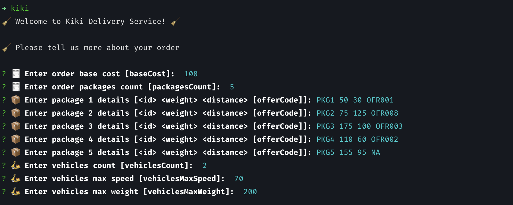
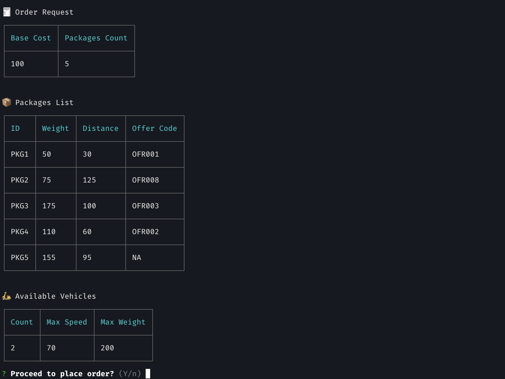
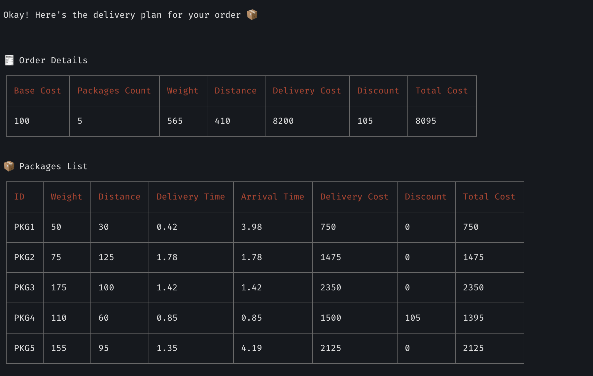
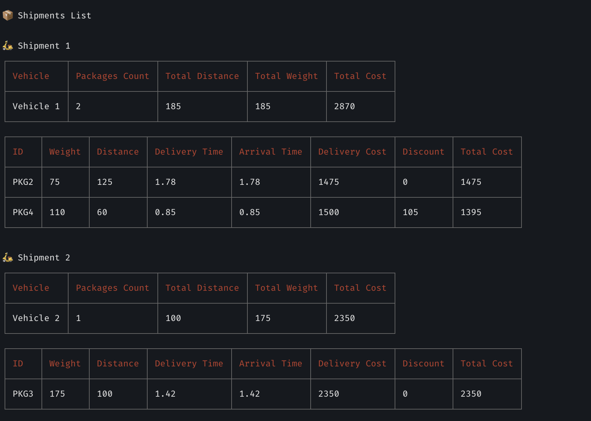
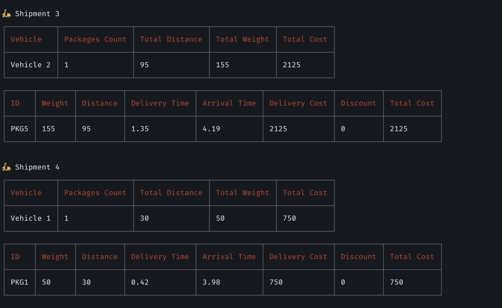
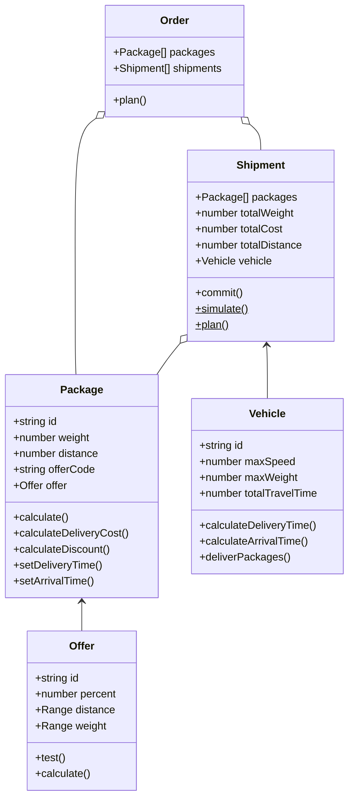

# Everest Engineering - Kiki Delivery Service


Welcome to Kiki Delivery Service! This project is created as part of Everest Engineering's interview process. This is a simple CLI application that allows you to create a delivery order, and outputs the costs of the order, the delivery time as well as the shipment plan.

## Getting Started

### Prerequisites

You will need either of the following to run this project:

- Node.js v18 or above OR
- Bun v1.0.2 or above

This project was created using `bun init` in bun v1.0.2. [Bun](https://bun.sh) is a fast all-in-one JavaScript runtime. However, you can also run this project using Node.js.

### Running using npm (Node.js)

```bash
npm install
npm start

> everest-kiki@1.0.0 start
> ts-node src/cli/kiki.ts

🧹 Welcome to Kiki Delivery Service! 🧹

🧹 Please tell us more about your order

? 🧾 Enter order base cost [baseCost]:
```

### Running using Bun

```bash
bun install
bun start
```

## Using the CLI

This project is a CLI application. After you start the application, you will be prompted to enter the order details.  

The `id`, `weight` and `distance` arguments are required for each Package. The `offerCode` argument is optional.

Note that you can also run the application with the order details as command line arguments. See [Installing as a global CLI tool](#installing-as-a-global-cli-tool) for more details.


```
➜ kiki

🧹 Welcome to Kiki Delivery Service! 🧹

🧹 Please tell us more about your order

? 🧾 Enter order base cost [baseCost]:  100
? 🧾 Enter order packages count [packagesCount]:  5
? 📦 Enter package 1 details [<id> <weight> <distance> [offerCode]]: PKG1 50 30 OFR001
? 📦 Enter package 2 details [<id> <weight> <distance> [offerCode]]: PKG2 75 125 OFR008
? 📦 Enter package 3 details [<id> <weight> <distance> [offerCode]]: PKG3 175 100 OFR003
? 📦 Enter package 4 details [<id> <weight> <distance> [offerCode]]: PKG4 110 60 OFR002
? 📦 Enter package 5 details [<id> <weight> <distance> [offerCode]]: PKG5 155 95 NA
? 🛵 Enter vehicles count [vehiclesCount]:  2
? 🛵 Enter vehicles max speed [vehiclesMaxSpeed]:  70
? 🛵 Enter vehicles max weight [vehiclesMaxWeight]:  200
```

You will then be given a summary of your order details. If you wish to make changes to your order, you may start over by when prompted. 

After this, you will be shown a report of your order. This includes the total cost of the order, the delivery time as well as the shipment plan.


## Screenshots

### Taking an order



### Order confirmation


### Order summary


### Shipment plan




## Build

You can build this project to a single file using the following command:

```bash
npm run build 

# or

bun build
```

This will create a single file `kiki.js` in the project folder. You can then run the file without TypeScript or Bun installed.

```bash
node kiki.js

# or just run the file directly

./kiki.js

```

## Installing as a global CLI tool

You can also install this project as a global CLI tool using the following command. This will add `kiki` as a command in your terminal. You can then run the command anywhere in your terminal.


```bash
npm link

kiki -h

Usage: kiki [options]

Everest Engineering - Kiki Delivery Service. Create an order and retrieve a delivery plan.

Options:
  -b, --base-cost <number>            Base cost
  -p, --packages-count <number>       Packages count
  -c, --vehicles-count <number>       Vehicles count
  -s, --vehicles-max-speed <number>   Vehicles max speed
  -w, --vehicles-max-weight <number>  Vehicles max weight
  -h, --help                          display help for command
```

You can run the command with the supported options to save time when creating an order. If you supply all options via the CLI, you will not be prompted to enter the order details, and instead you proceed to enter details for each package directly.

For example, you can run: 

```bash
# Specify which option you want as part of the command. All options are optional.
kiki --base-cost 100 --packages-count 5 --vehicles-count 2 --vehicles-max-speed 70 --vehicles-max-weight 200

# Or you can use the short version instead
kiki -b 100 -p 5 -c 2 -s 70 -w 200

# You should see the following output:

🧹 Welcome to Kiki Delivery Service! 🧹

🧹 You have provided the following options 👀:
  * baseCost: 100
  * packagesCount: 5
  * vehiclesCount: 2
  * vehiclesMaxSpeed: 70
  * vehiclesMaxWeight: 200

🧹 Please tell us more about your order

? 📦 Enter package 1 details [<id> <weight> <distance> [offerCode]]:
```

## Running tests

This project uses Jest for testing. You can run the tests using the following command:

```bash

npm test

# Or

bun run test

```

## Class diagram



## Packages

This project uses the following packages:

- [commander](https://www.npmjs.com/package/commander) - For creating the CLI
- [inquirer](https://www.npmjs.com/package/inquirer) - For prompting the user for input
- [zod](https://www.npmjs.com/package/zod) - For validating the input
- [cli-table3](https://www.npmjs.com/package/cli-table3) - For rendering tables in the CLI

## License

This project is licensed under the MIT License. See the [LICENSE](./LICENSE) file for more details.